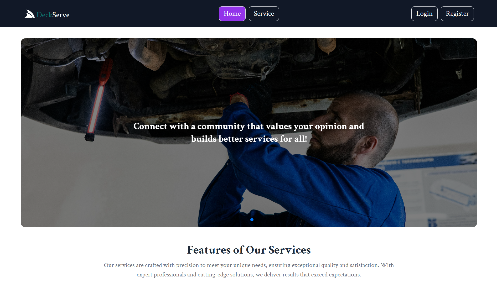

# DeckServe

DeckServe is a platform designed to explore different service experiences, find exclusive and customer needed services, and consult with service for get there wanted service.

## Purpose

- Browse a variety of Services
- Get the customer or user wanted Services easily.
- Also Get the Guidence which Service is Best for give good user experience.

## Live URL

https://deckservice-e6fc4.web.app

## Key Features

- User-Friendly UI/UX design for seamless exploration.
- Details about each different Services.
- Option for users to review the services.
- Option for users to rating the services.
- Optimized for all devices (mobile, tablet, desktop).
- Easily find user needed service with search & filterized.
- Easily added the services.

## Key Technology Used

- **React** 
- **React Router**
- **React Icon**
- **AOS**
- **Firebase**
- **Axios**
- **swipperJS**
- **MongoDb**
- **DaisyUi**

### Dependencies
- date-fns: version-4.1.0
- react-datepicker: version-7.5.0
- react-helmet: version-6.1.0
- react-hot-toast: version-2.4.1
- react-spinners: version-0.15.0

### How to Work

- clone the repo
- install required dependencies
- change the base url into local